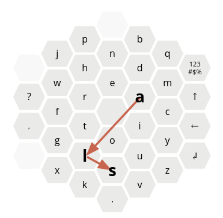

# Keyboard Layout Optimization for ALS Patients

This competition is organized together with the [DSSG Summit 2020](http://www.summit.dssg.pt/competition). Its goal is to optimize a keyboard layout to minimize the workload for usage by an ALS patient. This was motivated by [Anthony Carbajal](http://www.anthonycarbajal.com), a full-time daily life hacker that aims to find innovative ways to improve his and other ALS-patient lives, with whom we worked together for developing a first version of this solution. You will work in creating innovative solutions to the problem we tried to solve!

**[Here's a video summary of the challenge](https://www.youtube.com/watch?v=hlCuucN-r9U&feature=youtu.be)**

## Building a solution and evaluation

In this challenge, you will be working with an hexagonal keyboard. 

Keyboard indexes are done by serialization of the positions by clockwise traversing of the concentric rings. Each position contains the proposed letter (right image). The problem translates to finding the best permutation, which is a well-known established optimization problem.

The problem will be evaluated using two different criteria: objective and subjective criteria.

**Objective criteria**

We assume the writing effort is proportional to the expected distance traveled in the transition between each pair of letters (left image).

Participants will be ranked according to a cost function based on the cost of writing a large corpus of text using the proposed keyboard layout.

We will evaluate the final solution on a new corpus. The presented score is calculated according to the cost function on `compute_cost.py` which computes the minimum cost for writing a text given a layout distribution. We provide a small sample text that you can use to validate your approach, but we will be using a different (much larger) dataset to rank the solutions.

You should submit a solution for both portuguese and english language.

**Available data** 

- `data/pt-corpus.txt` (A sample text in Portuguese that only uses the valid characters)
- `data/en-corpus.txt` (A sample text in English that only uses the valid characters)

And the list of valid keys for each language is given in:
- `data/pt-keys.txt`.
- `data/en-keys.txt`.
Be aware that some keys are used to signal special characters.

Namely,
- The ENTER key is represented as 0.
- The shift key for capitalization is represented as ^.
- The backspace key is represented as <.
- All the remaining characters not found in the valid keys are encoded as #.
- Empty keys will contain the character _.

Your keyboard may have duplicate keys (in which case the cost function will compute the minimum effort for writing a text).
If there is any missing key, the cost function for your keyboard will be infinity.

**Subjective criteria**

You should submit a Youtube video containing a maximum 3 minute pitch (with slides presentation, or just a video of you talking) describing what you would do to solve this issue of keyboard optimization. Do not talk about what you did in technical terms, but focus on topics like:

- Alternative keyboard layouts, and why they are better than the hexagonal one
- Changes in eye tracking technology and other interaction mechanisms
- Different transition matrix, instead of being at a character level (how and why?) 
- How well would your idea scale to other languages
- How you would make this compatible with multiple wheelchairs and interfaces

Your video will be evaluated according to criteria such as:

- Benchmarking of similar solutions
- Creativity
- Future improvement of idea and opportunities
- Scalability of presented idea
- Replicability of presented idea
- Practicability of presented idea
- Presentation skills - organization and logical flow of pitch

## Registration and Instructions

You should register between 1 and 5 team members for this competition, [on the registration form](https://forms.gle/tz4LKmwXunSGAAEHA).

**Dates**
- Registrations: Until 16th of October. 
- Competition Material: Available from 6th October. 
- Submission date: Between 9th and 16th of October. 
- Results presentation: 21st of October, during the DSSG Summit closing session. 

Please join the [Slack Channel](
https://join.slack.com/t/dssgsummit202-dgf8036/shared_invite/zt-hgkylr45-CdWezJO0HPyOJLD7360ZNw) for this competition and send us (anyone with the suffix NILG.AI in the name) a message where we will create a slack channel for your team. You can also use this Slack Channel for finding teams.

**Submission Form**

Submission form will be available from 7th of October. 
You will need to submit a video for subjective evaluation and the keyboard distribution for Portuguese and English as plain text characters following the index of the following image:

For instance, the keyboard on the left, would be encoded as " EAIOTRNDMCYUSLGFWH_BQ#^<0ZV.KX_,?_JP"

You will be able to submit multiple times, but you should be able to check your own results with the script `compute_cost.py`.  

**Leaderboard**

The participants' leaderboard will be presented here on Github. It will be updated daily. 

## Prizes

The winning team of this competition will be given a 300€ Amazon gift card, split by the number of members of the team. 

Any further questions, you may direct them to us on the Slack channel or by creating a Github Issue.

## Legal 

All code should be open source, in a public Github repository.

The evaluation will be conducted by an external party (to be announced). Juries will report any conflict of interest.

